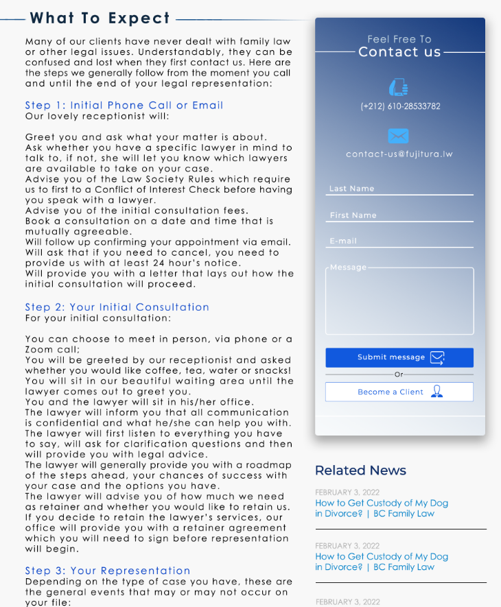

# WeLegal Web Application

**WeLegal** is a web application designed to facilitate the management of law firms, particularly focusing on improving the interaction between clients and lawyers. It aims to enhance efficiency, reduce administrative burdens, and streamline case management. Built using modern technologies like React, Laravel, and MySQL, WeLegal allows clients to find lawyers, book consultations, and manage case details seamlessly while providing lawyers with a dedicated dashboard to manage their cases, schedules, and client communications.


## Features
- **Client Features:**
  - Register and manage a personal dashboard.
  - Book free consultations.
  - Add and manage case details.
  - Pay lawyers online.
  - Communicate with lawyers via chat.
- **Lawyer Features:**
  - Access a personal dashboard.
  - View and update client case details.
  - Schedule appointments and consultations.
  - Communicate with clients via chat.
  - Manage case documents and information.

 
## Technologies Used
- **Frontend:** React.js, JSX, SCSS, Bootstrap
- **Backend:** Laravel, PHP
- **Database:** MySQL
- **Other Tools:** Visual Studio Code, Adobe Photoshop, Lucidchart, Notion

## Usage
1. Clone this repository:
```python
git clone https://github.com/isMeXar/WeLegal-Web-Application-April-2022.git
```
2. Navigate to the project directory:
```python
cd WeLegal-Web-Application-April-2022
```
3. Install the backend dependencies:
```python
composer install
```
4. Set up the environment variables:
```python
cp .env.example .env
php artisan key:generate
```
5. Set up the database:
- Create a new database in MySQL and update the .env file with your database credentials.
- Run the migrations:
```python
php artisan migrate
```
6. Install frontend dependencies:
```python
npm install
```
7. Run the development server:
```python
npm run dev
php artisan serve
```

Your application should now be running on http://localhost:8000.

## Screenshots
Here are some key screenshots from the application:

- **Home Page:** Here is a part of the Home page.
<br><br>
Here you will find the [full home page](img/Design/Full%20Home%20Page.jpg).
<br>
<br>

- **About Page:** Here is a part of the About page.
<br><br>
Here you will find the [full about page](img/Design/Full%20About%20Page.jpg).
<br>
<br>

- **Successfull Stories Page:**
<br><br>
<br>
- **Attorney Page:** You select the attorney and you will be able to see details about them.
Here you will find the [full attorney page](img/Design/Full%20Attorney%20Page.jpg).
<br>
<br>

- **Lawyer Dashboard:**
  - **Home:**
  <br><br>
  - **Clients list:**
  <br><br>
  - **Consulting page:**
  <br><br>
  - **Appointements:**
  <br><br>

- **Client Dashboard:**
  - **Home:**
  <br><br>
  - **Add a Case:**
  <br><br>
  - **Consulting page:**
  <br><br>

- Footer: <br>
<br>
## Conclusion
The WeLegal web application is a comprehensive solution designed to modernize and simplify law firm management. By providing an efficient platform for both clients and lawyers to manage cases, schedules, and communications, WeLegal helps to streamline legal practices and improve productivity. This project represents the culmination of our academic journey and showcases our ability to apply theoretical knowledge to solve real-world problems.

While the application serves as a valuable tool for law firms, we believe there are always opportunities for improvement. Future updates could include additional features, better compatibility with local legal systems, and enhanced security measures. Ultimately, the goal is to make legal services more accessible and efficient, not just in Morocco but globally, by further expanding the capabilities of the WeLegal platform.

We hope that WeLegal will make a positive impact on law firm operations and client satisfaction, offering a seamless, user-friendly experience for both parties.
